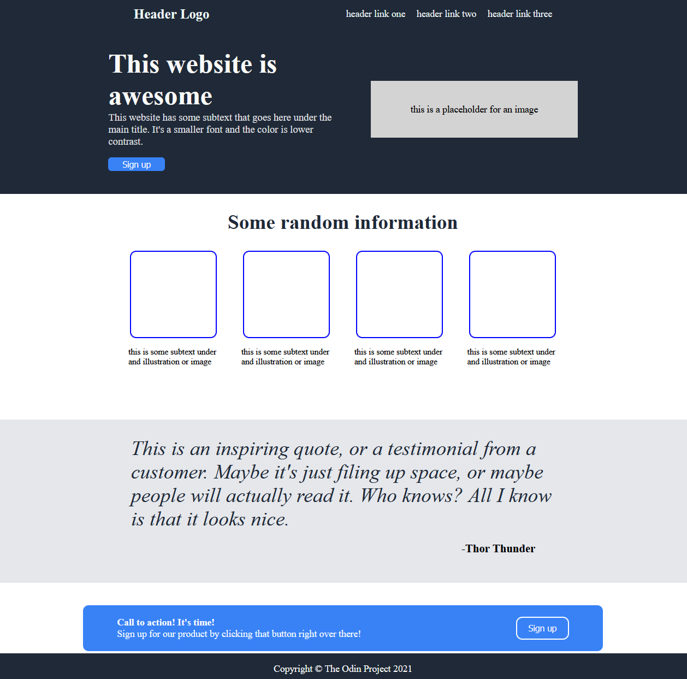

# Landing Page

This project uses HTML and CSS to build a simple landing page. The project focuses mainly on practicing CSS with Flexbox.

## The Odin Project: Lesson Landing Page

This project is build according to the specification of the [Landing Page lesson](https://www.theodinproject.com/lessons/foundations-landing-page)

## Live Website

Access the [Landing Page](https://gohan61.github.io/landing-page2/)

